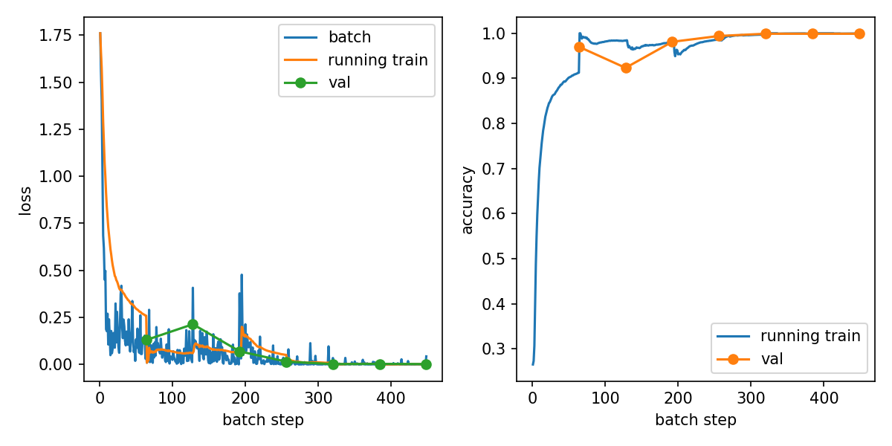

# 机器视觉原理课程作业：HandSignDL


>本项目是一个基于 PyTorch 的手势姿态识别项目。模型使用 torchvision 的 ResNet50，并默认加载 ImageNet 预训练权重进行微调。

## 目录

- [机器视觉原理课程作业：HandSignDL](#机器视觉原理课程作业handsigndl)
  - [目录](#目录)
  - [项目结构](#项目结构)
  - [环境配置](#环境配置)
  - [配置系统](#配置系统)
  - [模型结构](#模型结构)
  - [训练配置](#训练配置)
  - [输出文件](#输出文件)
  - [训练](#训练)
  - [测试](#测试)
  - [实验结果](#实验结果)

## 项目结构

```text
.
|-- configs/
|   `-- default.yaml              # 默认训练/测试配置
|-- data/
|   `-- Hand_Posture_Hard_Stu/    # 手势图片数据集，按类别目录存放
|-- model/
|   |-- best_model.pth            # 训练得到的最佳模型权重
|   `-- resnet50-11ad3fa6.pth     # ResNet50 ImageNet 预训练权重
|-- outputs/
|   |-- training_curves.png       # 训练曲线图
|   `-- training_history.csv      # 训练过程记录
|-- src/
|   `-- core.py                   # 数据加载、模型构建、训练/评估等核心逻辑
|-- train.py                      # 训练入口脚本
|-- test.py                       # 测试/推理入口脚本
|-- requirements.txt              # Python 依赖列表
|-- repoet.md                     # 课程设计报告
|-- LICENSE
|-- README.md
`-- .gitignore
```

## 环境配置

本项目使用 Python 3.11，主要依赖包括 `numpy`、`torch`、`torchvision`、`Pillow` 、`matplotlib` 和 `PyYAML`。

```powershell
conda create -n HandSignDL python=3.11 -y
pip install -r requirements.txt
```

数据文件需要放在本地 `data/` 目录下，例如：

```text
data/Hand_Posture_Hard_Stu
```

## 配置系统

默认配置文件位于 `configs/default.yaml`：

```yaml
paths:
  data_dir: ./data/Hand_Posture_Hard_Stu
  train_data_dir: ./data/Hand_Posture_Hard_Stu
  test_data_dir: ./data/Hand_Posture_Hard_Stu
  output_dir: ./outputs
  model_path: ./model/best_model.pth
  input_model_path: ./model/best_model.pth
  pretrained_weights_path: ./model/resnet50-11ad3fa6.pth

train:
  epochs: 7
  batch_size: 64
  lr: 0.001
  device: cuda
  progress_interval: 10
  pretrained: true
```

## 模型结构

本项目使用 `torchvision.models.resnet50` 构建分类模型。模型默认加载 ImageNet 预训练权重，并将 ResNet50 原本用于 1000 类分类的全连接层替换为 6 类输出层，对应 `A`、`B`、`C`、`Five`、`Point`、`V` 六类手势。

输入图像在训练和推理前统一缩放/裁剪为 `224 x 224`，再按 ImageNet 均值和标准差进行归一化。训练阶段使用随机裁剪、随机水平翻转、颜色增强和亮度增强；验证阶段使用固定尺寸缩放，保证评估结果稳定。

## 训练配置

默认训练参数来自 `configs/default.yaml`：

| 参数 | 默认值 | 说明 |
| --- | --- | --- |
| `image_size` | `224` | 输入图像尺寸 |
| `val_ratio` | `0.2` | 验证集比例 |
| `epochs` | `7` | 训练轮数 |
| `batch_size` | `64` | 批大小 |
| `lr` | `0.001` | 初始学习率 |
| `device` | `cuda` | 训练设备 |
| `pretrained` | `true` | 是否使用预训练权重 |

训练脚本使用交叉熵损失函数、AdamW 优化器和 CosineAnnealingLR 学习率调度器。每轮训练结束后会在验证集上计算损失、整体准确率和各类别准确率，并保存验证准确率最高的模型权重。

## 输出文件

训练和测试相关文件默认保存在以下位置：

| 文件 | 说明 |
| --- | --- |
| `model/best_model.pth` | 验证集准确率最高的模型权重 |
| `outputs/training_history.csv` | 训练过程记录，包含 batch 级损失和 epoch 级验证指标 |
| `outputs/training_curves.png` | 训练损失、累计训练损失和验证损失曲线 |
| `model/resnet50-11ad3fa6.pth` | 本地 ResNet50 ImageNet 预训练权重 |

## 训练

**使用配置文件夹：**

```powershell
python train.py
```

**使用命令行参数：**

```powershell
python train.py `
  --train_data_dir ./data/Hand_Posture_Hard_Stu `
  --output_model_path ./model/best_model.pth `
  --pretrained_weights_path ./model/resnet50-11ad3fa6.pth `
  --output_dir ./outputs `
  --epochs 5 `
  --device cuda `
  --progress_interval 10
```

## 测试

**使用配置文件夹：**

```powershell
python test.py
```

**使用命令行参数：**

```powershell
python test.py `
  --test_data_dir ./data/Hand_Posture_Hard_Stu `
  --input_model_path ./model/best_model.pth `
  --device cuda
```

`test.py` 会递归检测测试目录下的常见图片格式：`.png`、`.jpg`、`.jpeg`、`.bmp`、`.webp`。

## 实验结果

当前 `outputs/training_history.csv` 记录的训练共 7 轮。验证集最佳准确率为 `99.90%`，从第 5 轮开始达到并保持在该水平。

| 轮次 | 训练损失 | 训练准确率 | 验证损失 | 验证准确率 |
| ---: | ---: | ---: | ---: | ---: |
| 1 | 0.2593 | 91.25% | 0.1300 | 97.01% |
| 2 | 0.0607 | 98.36% | 0.2138 | 92.34% |
| 3 | 0.0602 | 97.99% | 0.0700 | 98.11% |
| 4 | 0.0510 | 98.59% | 0.0150 | 99.40% |
| 5 | 0.0096 | 99.68% | 0.0019 | 99.90% |
| 6 | 0.0034 | 99.93% | 0.0031 | 99.90% |
| 7 | 0.0018 | 99.93% | 0.0021 | 99.90% |

第 7 轮各类别验证准确率如下：

| 类别 | 验证准确率 |
| --- | ---: |
| A | 99.62% |
| B | 100.00% |
| C | 100.00% |
| Five | 100.00% |
| Point | 100.00% |
| V | 100.00% |

训练曲线保存在 `outputs/training_curves.png`：


