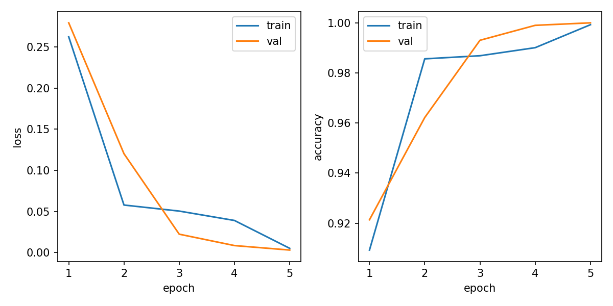

# 基于深度学习的手势姿态识别实验报告

## 一、实验目的

本实验以手势姿态图像分类为任务，使用 PyTorch 搭建并训练深度学习识别模型，实现对 `A`、`B`、`C`、`Five`、`Point`、`V` 六类手势图像的自动识别。通过本实验，掌握图像分类任务中数据读取、图像预处理、模型构建、迁移学习训练、验证评估和模型推理的基本流程。

本实验的具体目标如下：首先，理解卷积神经网络在图像特征提取中的作用；其次，掌握利用 ResNet50 预训练模型进行迁移学习的方法；再次，完成手势图像数据集的训练集和验证集划分，并使用准确率和损失值评价模型性能；最后，保存训练得到的最佳模型，并能够对测试图片进行类别预测。

## 二、实验原理

图像分类的核心目标是从输入图像中提取有效视觉特征，并将其映射到对应类别。传统方法通常依赖人工设计特征，而深度学习方法可以通过卷积神经网络自动学习边缘、纹理、局部形状以及高级语义特征。卷积层负责提取局部空间特征，池化或步长卷积可以降低特征图尺寸，全连接层或分类头将高维特征转换为类别概率。

本实验采用 ResNet50 作为主干网络。ResNet50 引入残差连接，通过将输入特征直接传递到后续层，缓解深层网络训练中的梯度消失和退化问题。模型默认加载 ImageNet 预训练权重，然后将最后的全连接层替换为六分类输出层。这样可以利用预训练模型已经学习到的通用视觉特征，提高小规模手势数据集上的训练效率和识别效果。

训练过程中使用交叉熵损失函数衡量预测类别分布与真实标签之间的差异。优化器采用 AdamW，并加入权重衰减以抑制过拟合。学习率调度器采用余弦退火策略，使学习率在训练过程中逐步变化。数据增强包括随机裁剪、随机水平翻转、颜色扰动和亮度扰动，用于提高模型对手势位置、方向和光照变化的适应能力。

## 三、实验步骤

本实验使用的数据集位于 `data/Hand_Posture_Hard_Stu` 目录下，共包含 5040 张 PNG 图像，类别分布如下。

| 类别 | 图像数量 |
| --- | ---: |
| A | 1327 |
| B | 508 |
| C | 604 |
| Five | 707 |
| Point | 1394 |
| V | 500 |

实验环境依赖主要包括 `torch`、`torchvision`、`Pillow`、`numpy` 和 `matplotlib`。训练脚本默认使用 CUDA 设备，因此训练前需要确认当前 PyTorch 环境可以使用 GPU。

实验流程如下。第一步，读取六类手势图像，并根据类别目录生成图像路径和标签。第二步，对训练图像进行随机裁剪、水平翻转、颜色增强和亮度增强，对验证图像进行固定尺寸缩放和张量归一化。第三步，按照 8:2 的比例进行分层划分，保证每个类别在训练集和验证集中都有样本。第四步，加载 ResNet50 模型，将分类层替换为六分类输出层。第五步，使用交叉熵损失函数、AdamW 优化器和余弦退火学习率策略训练 5 轮。第六步，在每轮训练结束后计算验证集整体准确率和各类别准确率，并保存验证准确率最高的模型。第七步，使用训练得到的 `best_model.pth` 对 `test_images` 目录下的图片进行推理。

训练命令如下：

```powershell
cd main
conda run -n myenv python train.py `
  --train_data_dir ../data/Hand_Posture_Hard_Stu `
  --output_model_path ./model/best_model.pth `
  --output_dir ./outputs `
  --epochs 5 `
  --device cuda `
  --progress_interval 10
```

推理命令如下：

```powershell
cd main
conda run -n myenv python test.py `
  --test_data_dir ./test_images `
  --input_model_path ./model/best_model.pth
```

## 四、程序代码

本实验的核心代码主要包括模型构建、数据预处理、训练验证和推理四部分。

模型构建代码如下。程序调用 `torchvision.models.resnet50` 构建 ResNet50，并将原始 ImageNet 分类头替换为六分类线性层。

```python
from torch import nn
from torchvision.models import ResNet50_Weights, resnet50


def build_model(num_classes: int = 6, pretrained: bool = True) -> nn.Module:
    weights = ResNet50_Weights.DEFAULT if pretrained else None
    model = resnet50(weights=weights)
    model.fc = nn.Linear(model.fc.in_features, num_classes)
    return model
```

数据预处理代码如下。训练阶段使用随机裁剪、随机翻转、颜色增强和亮度增强；验证阶段使用固定尺寸缩放。图像随后按照 ImageNet 均值和标准差进行归一化。

```python
class TrainTransform:
    def __init__(self, image_size: int = 64) -> None:
        self.image_size = image_size

    def __call__(self, image: Image.Image) -> torch.Tensor:
        image = ensure_rgb(image).resize((self.image_size + 8, self.image_size + 8))
        left = random.randint(0, 8)
        top = random.randint(0, 8)
        image = image.crop((left, top, left + self.image_size, top + self.image_size))
        if random.random() < 0.5:
            image = image.transpose(Image.FLIP_LEFT_RIGHT)
        image = ImageEnhance.Color(image).enhance(random.uniform(0.85, 1.15))
        image = ImageEnhance.Brightness(image).enhance(random.uniform(0.85, 1.15))
        return image_to_tensor(image)
```

单轮训练与验证的核心逻辑如下。训练时开启梯度计算并更新参数，验证时关闭梯度计算，只统计损失值和分类准确率。

```python
def run_epoch(model, loader, criterion, device, optimizer=None):
    training = optimizer is not None
    model.train(training)
    total_loss = 0.0
    total_correct = 0
    total_count = 0

    for images, labels in loader:
        images = images.to(device)
        labels = labels.to(device)

        with torch.set_grad_enabled(training):
            logits = model(images)
            loss = criterion(logits, labels)
            if training:
                optimizer.zero_grad()
                loss.backward()
                optimizer.step()

        total_loss += loss.item() * labels.size(0)
        total_correct += (logits.argmax(dim=1) == labels).sum().item()
        total_count += labels.size(0)

    return total_loss / total_count, total_correct / total_count
```

推理阶段对单张图片构造多视角测试增强，包括四角裁剪、中心裁剪和水平翻转，并对多个视角的 logits 求平均，以提高预测稳定性。

```python
def predict_image(model, image, image_size, device):
    tensors = build_tta_tensors(image, image_size)
    batch = torch.stack(tensors).to(device)
    logits = model(batch)
    return logits.mean(dim=0, keepdim=True)
```

## 五、实验结果显示

训练共进行 5 轮，训练历史保存在 `outputs/training_history.csv`，训练曲线保存在 `outputs/training_curves.png`。新版训练历史按 batch 记录 `batch_loss` 和 `running_train_loss`，并按 epoch 记录验证指标；训练曲线会同时展示 batch loss、累计训练 loss 和验证 loss。训练结果如下表所示。

| 轮次 | 训练损失 | 训练准确率 | 验证损失 | 验证准确率 |
| ---: | ---: | ---: | ---: | ---: |
| 1 | 0.2623 | 0.9093 | 0.2793 | 0.9214 |
| 2 | 0.0578 | 0.9856 | 0.1202 | 0.9622 |
| 3 | 0.0504 | 0.9869 | 0.0223 | 0.9930 |
| 4 | 0.0390 | 0.9901 | 0.0085 | 0.9990 |
| 5 | 0.0051 | 0.9993 | 0.0030 | 1.0000 |

第 5 轮训练结束时，模型在验证集上达到 100.00% 的整体准确率。各类别验证准确率均为 100.00%，说明模型在当前验证划分上能够正确识别六类手势。

| 类别 | 第 5 轮验证准确率 |
| --- | ---: |
| A | 100.00% |
| B | 100.00% |
| C | 100.00% |
| Five | 100.00% |
| Point | 100.00% |
| V | 100.00% |

训练曲线如下：



最佳模型已保存到 `model/best_model.pth`。当前 `test_images` 目录下未检测到待测试图片，因此本报告的结果展示以验证集指标和训练曲线为主。如果向 `test_images` 中加入图片并运行 `test.py`，程序会输出每张图片对应的预测类别。

## 六、实验分析总结

从训练结果看，模型的训练损失和验证损失均随训练轮次快速下降，验证准确率从第 1 轮的 92.14% 提升到第 5 轮的 100.00%。这说明 ResNet50 预训练特征对手势图像分类任务具有较好的迁移效果，模型能够在较少训练轮次内学习到有效的类别判别特征。

第 1 轮中部分类别准确率相对较低，例如 `B` 和 `C` 的验证准确率分别为 75.25% 和 77.50%。这可能是因为这些手势在局部形状上更容易与其他类别混淆，模型初期尚未充分学习到细粒度差异。随着训练进行，各类别准确率持续提升，说明数据增强、预训练模型和优化策略共同改善了模型的泛化能力。

需要注意的是，验证集准确率达到 100.00% 并不一定代表模型在所有真实场景中都能完全正确。当前验证集来自同一数据目录，图像采集条件、背景和手势风格可能与训练集较为接近。若要进一步验证模型的实际应用能力，应增加不同光照、背景、拍摄角度和不同人员手势的外部测试图片，并重点观察混淆类别的预测表现。

总体而言，本实验完成了从数据预处理、模型训练到结果评估的完整图像分类流程。实验表明，基于 ResNet50 的迁移学习方法能够有效完成六类手势姿态识别任务。后续可以从扩大测试集、加入混淆矩阵、调整输入分辨率、比较不同主干网络和增加真实场景样本等方面继续改进模型性能与实验说服力。
